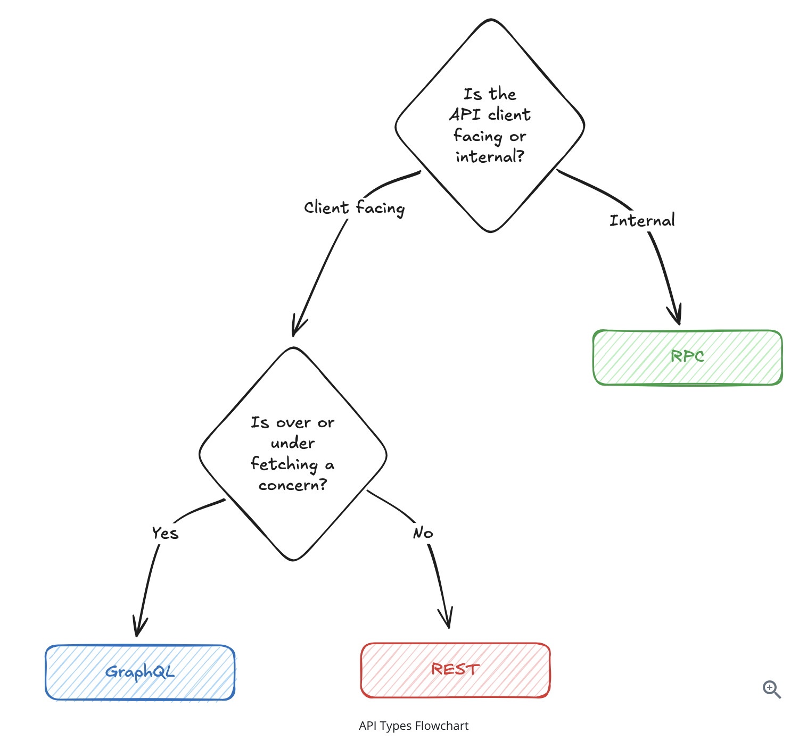

# Api Design Essentials

## Api Types 

In an interview, you'll typically choose between three main API protocols:

1. REST (Representational State Transfer) - REST uses standard HTTP methods to manipulate resources identified by URLs. This option should be your default choice when designing APIs in System Design interviews. 
2. GraphQL - Unlike REST's fixed endpoints, GraphQL uses a single endpoint with a query language that lets clients specify exactly what data they need. If your interviewer mentions "flexible data fetching" or talks about avoiding over-fetching and under-fetching, they're signaling you to consider GraphQL.
3. RPC (Remote Procedure Calls) - RPC protocols like gRPC use binary serialization and HTTP/2 for efficient communication between services. While REST treats everything as resources, RPC lets you think in terms of actions and procedures. For example - When your user service needs to quickly validate permissions with your auth service, an RPC call like `checkPermission(userId, resource)` is more natural than trying to model this as a REST resource. If the interviewer specifically mentions microservices or internal APIs, consider RPC for those high-performance connections.



## REST

### Resource Modeling

The foundation of good REST API design is identifying your resources correctly. Resources are just your core entities. Take Ticketmaster as an example. Your core entities might be events, venues, tickets, and bookings. These naturally map to REST resources:

```
GET /events                    # Get all events
GET /events/{id}               # Get a specific event
GET /venues/{id}               # Get a specific venue
GET /events/{id}/tickets       # Get available tickets for an event
POST /events/{id}/bookings     # Create a new booking for an event
GET /bookings/{id}             # Get a specific booking
```

Importantly, REST resources should represent things in your system, not actions. Instead of thinking about what users can do (like "book" or "purchase"), think about what exists in your system (events, venues, tickets, bookings). Also, resources should always be plural nouns. 

When handling relationships between resources, you have two main approaches. The key difference is whether the relationship is required or optional. Use path parameters (or nested resources) when the value is required. Use query parameters when the filter is optional. 

1. You can nest resources when there is a clear parent-child relationship. For example - `events/{id}/tickets`
2. You can keep resources flat and use query parameters. For example - `events/{id}/tickets?section=VIP`

### HTTP Methods

HTTP provides a set of methods (verbs) that map naturally to common operations

1. `GET` is for retrieving data without changing anything
2. `POST` creates new resources. POST operations are not typically idempotent
3. `PUT` replaces an entire resource with what you send, or create it if it doesn't exist. PUT is idempotent, so sending the same data multiple times results in the same final state.
4. `PATCH` updates part of a resource. PATCH operations are usually not idempotent. For example - PATCH a user's email is idempotent while appending an entry to the end of the list is not. 
5. `DELETE` removes a resource. DELETE operations are usually idempotent even though the response codes differ

### Passing Data to APIs

API endpoints need input to tell the server what to do. This can be which resources to fetch, what data to update in the database, or how to filter results. You have three main options for passing data to your REST API, and each serves a different purpose.

1. Path Parameter - Identify which specific resource you're working with. For example - `events/123`. The event ID is part of the URL structure itself. 
2. Query Parameter - Filter, sort or modify how you retrieve resources. `/events?city=NYC&date=2024-01-01`. These represent optional operations you want performed on the retrieved data. 
3. Request Body - Contains the actual data you're sending to create or update resources.

### Returning Data

An API Response is made up of two parts

1. The status code, which indicates whether the request was successful or not.
2. The response body, which contains the data you're returning to the client (typically JSON)

For status codes, stick to the common ones: 200 for success, 201 for created resources, 400 for bad requests, 401 for authentication required, 404 for not found, and 500 for server errors.

## Common API Patterns

Regardless of whether you choose REST, GraphQL, or RPC, there are some patterns that apply across all API types.

1. Pagination - When you're dealing with large datasets, you can't return everything at once. Instead, you need pagination to break large result sets into manageable chunks. There are two main approaches to pagination: offset-based and cursor-based.
- Offset-based pagination - Offset-based pagination is the simplest approach and used by most websites. You specify how many records to skip and how many to return: `/events?offset=20&limit=10` gets records 21-30. This is intuitive and easy to implement, but it has problems with large datasets. If someone adds a new event while you're paginating through results, you might see duplicates or miss records as the data shifts.
- Cursor-based pagination - Cursor-based pagination solves this by using a pointer to a specific record instead of counting from the beginning. The first request looks like this: `/events?limit=10`. The response to this request includes a pointer to the last record that was retrieved (For example - Something like `next_cursor`). You then use the cursor to skip over records that were previously retrieved to return a new set of records: `/events?cursor=cmd9atj3p000007ky19w1dpy2&limit=10`
2. Versioning - APIs evolve over time, and you need a strategy for handling changes without breaking existing clients. This is particularly important for public APIs where you can't control when clients update their code.
- URL Versioning - The most common approach is URL versioning, where you include the version number in the path: `/v1/events` or `/v2/events`. This is explicit and easy to understand.
- Header Versioning - Puts the version in an HTTP header instead: `Accept-Version: v2` or `API-Version: 2`. This keeps URLs cleaner and follows HTTP standards better, but it's less obvious to developers and harder to test in browsers.

## Security Considerations

Authentication verifies identity - proving the user is who they claim to be. Authorization verifies permissions - checking if that authenticated user is allowed to perform the specific action they're requesting. 

### API Keys

API keys are long, randomly generated strings that act like passwords for applications rather than humans. When a client makes a request, they include their API key in the Authorization header, and your server looks up that key to identify which application is making the request.

### JSON Web Tokens (JWT)

JWT Tokens encode encode user information directly into the token itself rather than storing session state on your server. When a user logs in successfully, your server creates a JWT containing their user ID, permissions, and an expiration time, then signs the entire token with a secret key.

Conveniently, when that JWT comes back with future requests, you can verify it's authentic by checking the signature, and you can read the user information directly from the token without any database lookups. The token itself carries all the context you need to authorize the request.

Use API keys for internal service communication and external developer access. Use JWT tokens for user sessions in web and mobile applications. JWT tokens can be stateless (no database lookup required) and can carry user context, making them ideal for user-facing applications.

### Role Based Access Control (RBAC)

RBAC assigns roles to users and permissions to roles. 

```
# Defining roles through RBAC and tagging each user with an appropriate role
Roles:
- customer: can book tickets, view own bookings
- venue_manager: can create events, view sales for their venues
- admin: can access everything

User: john@example.com → Role: customer
User: manager@venue.com → Role: venue_manager

When users use your API, you can use RBAC to perform authentication and authorization
GET /bookings/{id}
1. Is the user authenticated? (valid JWT token)
2. Is the user authorized? (owns this booking OR is admin)
```

### Rate Limiting and Throttling

Rate limiting prevents abuse by restricting how many requests a client can make in a given time period. This protects your system from both malicious attacks and accidental overuse. Common strategies include:

1. Per-user limits: 1000 requests per hour per authenticated user
2. Per-IP limits: 100 requests per hour for unauthenticated requests
3. Endpoint-specific limits: 10 booking attempts per minute to prevent ticket scalping

You typically implement rate limiting at the API gateway level or using middleware in your application. When limits are exceeded, return a `429 Too Many Requests` status code.