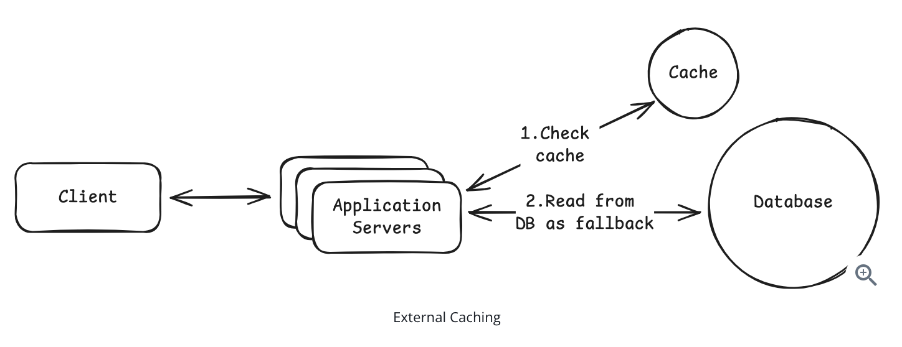
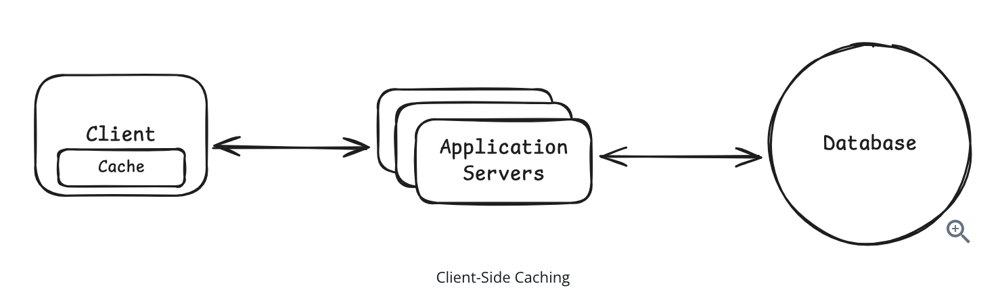
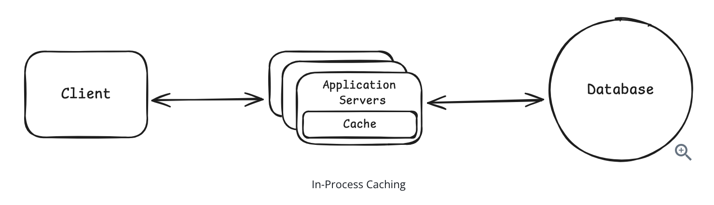
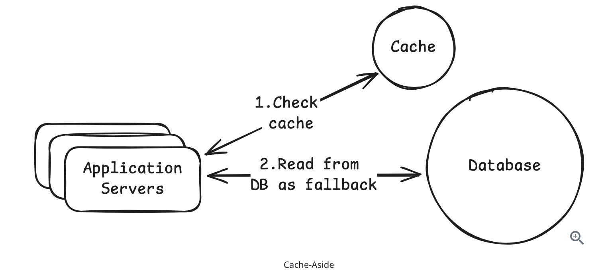
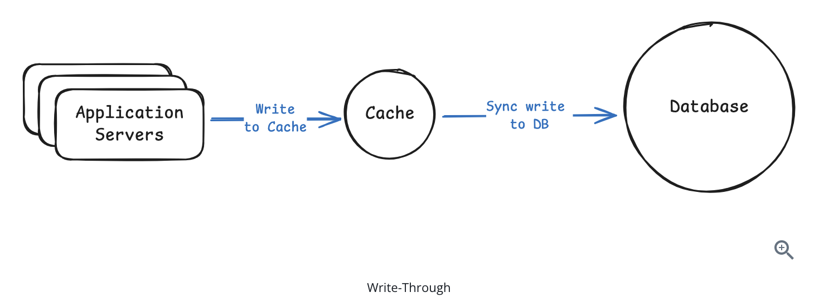
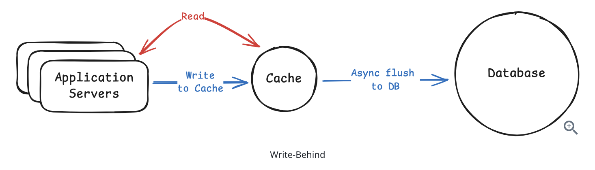
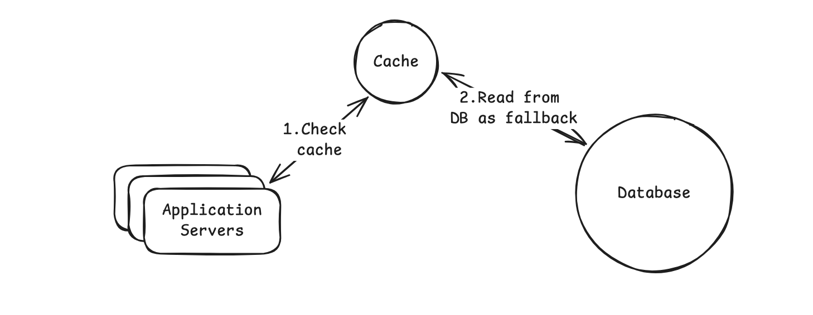

# Caching Essentials

In system design interviews, caching comes up almost every time you need to handle high read traffic. Your database becomes the bottleneck, latency starts creeping up, and the interviewer is waiting for you to say the word: cache. Caches are essential for scalable systems. They reduce load on the database and cut latency dramatically. But they also create new challenges around invalidation and failure handling.

## Where to Cache?

When most engineers hear caching, they immediately think of Redis or Memcached sitting between the application and the database. It is the most common type of cache and the one interviewers care about the most. But caching shows up in multiple layers of a system. Browsers cache. CDNs cache. Applications cache. Even databases have built-in caching layers. Let's look at the main places you can cache data and when it makes sense to use it. 

### External Caching 

An external cache is a standalone cache service that your application talks to over the network. You store frequently accessed data in something like Redis or Memcached so you do not have to hit the database every time. External caches scale well because every application server can share the same cache. They also support eviction policies like LRU and expiration via TTL so your memory footprint stays controlled.

In system design interviews, external caching with Redis is the default answer when discussing caching strategies. Interviewers expect you to mention it for any high-traffic system. Start here, then layer on other caching types such as CDN or client-side caching only if the problem calls for them.

### CDN (Content Delivery Network)

A CDN is a geographically distributed network of servers that caches content close to users. Instead of every request traveling to your origin server, a CDN stores copies of your content at edge servers around the world.

Modern CDNs like Cloudflare, Fastly, and Akamai can cache much more than static files. They can also cache public API responses, HTML pages, and even run edge logic to personalize content or enforce security rules before requests reach your servers. But the most common and most impactful use of a CDN is still media delivery. Talk about CDNs in System Design interviews if you are asked to serve static media at scale. 

### Client-side Caching

Client-side caching stores data close to the requester to avoid unnecessary network calls. This usually means the user's device. For user-facing caching, you have limited control from the backend. Data can go stale and invalidation is harder.

### In-process Caching

If your service keeps requesting the same small pieces of data again and again, store them in a local cache inside the process. Reads from local memory are even faster than reads from Redis because they avoid any network call. This light-weight form of caching makes sense for small pieces of data that are requested frequently like:

1. Configuration values
2. Feature flags
3. Small reference datasets
4. Hot keys
5. Rate limiting counters
6. Precomputed values

In-process caching is blazing fast, but it comes with obvious limitations. Each instance of your application has its own cache, so cached data is not shared across servers. If one instance updates or invalidates a cached value, the others will not know.

## Cache Architectures

There are 4 core cache patterns you should know for System Design Interviews

### Cache Aside (Lazy Loading)

This is the most common caching pattern and the one you should default to in interviews.

1. Application checks the cache.
2. If the data is there, return it.
3. If not, fetch from the database, store it in the cache, and return it.

Cache-aside only caches data when needed, which keeps the cache lean. The downside is that a cache miss causes extra latency. If you only remember one caching pattern for interviews, make it cache-aside.

### Write Through Cache

With write-through caching, the application writes only to the cache. The cache then synchronously writes to the database before returning to the application. The write operation does not complete until both the cache and database are updated. 

This requires a cache implementation that supports write-through, like a caching library. When you write to the cache, the library handles calling your database write logic before acknowledging the write.

The tradeoff is slower writes because the application must wait for both the cache update and the database write to complete. Write-through can also pollute the cache with data that may never be read again. Write-through also suffers from the dual-write problem. If the cache update succeeds but the database write fails, or vice versa, the systems can end up inconsistent. You need retry logic, error handling, or eventually accept that perfect consistency is difficult without distributed transactions.

Use this pattern when reads must always return fresh data and your system can tolerate slightly slower writes.

### Write Behind (Write Back) Caching 

The application writes only to the cache. The cache batches and writes the data to the database asynchronously in the background.

This makes writes very fast, but introduces risk. If the cache crashes before flushing, you can lose data. This is best for workloads where occasional data loss is acceptable. Use this when you need high write throughput and eventual consistency is acceptable. Common in analytics and metrics pipelines.

### Read Through Caching

With read-through caching, the cache acts as a smart proxy. Your application never talks to the database directly. On a cache miss, the cache itself fetches from the database, stores the data, and returns it. This is the read equivalent of write-through. In both patterns, the cache acts as an intermediary that handles database operations.

CDNs are a form of read-through cache. When a CDN gets a cache miss, it fetches from your origin server, caches the result, and returns it. But for application-level caching with Redis, cache-aside is far more common.

## Cache Eviction Policies

Caches have limited memory, so they need a strategy for deciding which entries to remove when full. These strategies are called eviction policies.

1. LRU (Least Recently Used)
- LRU evicts the item that has not been accessed for the longest time. It tracks access order using a linked list or ring buffer so the least recently used item can be removed in constant time.
- Adapts well to most workloads where recently used data is likely to be used again.
2. LFU (Least Frequently Used)
- LFU evicts the item that has been accessed the least. It maintains a counter for each key and removes the one with the lowest frequency. Some implementations use approximate LFU to avoid the cost of precise frequency tracking.
- Used when you want to cache consistenly popular keys like Trending Videos or Top Playlists
3. FIFO (First In First Out)
- FIFO evicts the oldest item in the cache based only on insertion time. It can be implemented with a simple queue, but it ignores usage patterns.
- Because it may evict items that are still hot, it is rarely used in real systems beyond simple caching layers.
4. TTL (Time to live)
- TTL is not an eviction policy by itself. Instead, it sets an expiration time for each key and removes entries that are too old. It is often combined with LRU or LFU to balance freshness and memory usage.

## Common Caching Problems

### Cache Stampede (Thundering Herd)

A cache stampede happens when a popular cache entry expires and many requests try to rebuild it at the same time. There is a brief window, even if only a second, where every request misses the cache and goes straight to the database. Instead of one query, you suddenly have hundreds or thousands, which can overload the database.

How to handle it?

1. Request coalescing (single flight): Allow only one request to rebuild the cache while others wait for the result. This is the most effective solution.
2. Cache warming: Refresh popular keys proactively before they expire. This only helps when using TTL-based expiration. If you invalidate cache on writes instead, warming does not prevent stampedes.

### Cache Consistency 

This happens when the cache and DB return different values for the same key. This is common because most systems read from the cache but write to the database first. That creates a window where the cache still holds stale data.

How to handle it?

1. Cache invalidation on writes: Delete the cache entry after updating the database so it gets repopulated with fresh data.
2. Short TTLs for stale tolerance: Let slightly stale data live temporarily if eventual consistency is acceptable.
3. Accept eventual consistency: For feeds, metrics, and analytics, a short delay is usually fine.

### Hot Keys

A hot key is a cache entry that receives a huge amount of traffic compared to everything else. Even if the cache hit rate is high, a single hot key can overload one cache node or one Redis shard and become a bottleneck.

How to handle it?

1. Replicate hot keys: Store the same value on multiple cache nodes and load balance reads across them.
2. Add a local fallback cache: Keep extremely hot values in-process to avoid pounding Redis.
3. Apply rate limiting: Slow down abusive traffic patterns on specific keys.

## Caching in System Design Interviews

### When to bring up caching?

Don't jump straight to caching. You need to establish why it's necessary first. Bring up caching when you identify one of these problems.

1. Read-heavy workload - 10 million users, 20 read requests per day for a total of 200 million read requests. Hitting the DB takes 20 - 50 milliseconds per query. We can serve the same content using a cache in under 2 ms
2. Expensive Queries - Computing User's personalized feed is an expensive operation that requires joining multiple tables. Cache the computed feed with a TTL of 60 seconds and serve it from cache
3. Latency Requirements - We need sub-10ms response times for the API. Database queries are taking 30-50ms. We have to cache

### How to introduce caching?

Follow these steps to walk through your caching stategy systematically

1. Identify the bottleneck
- Start by pointing to the specific problem caching will solve. Is it database load? Query latency? Expensive computations? Be specific about what's slow and why.
2. Decide what to cache
- Not everything should be cached. Focus on data that is read frequently, doesn't change often, and is expensive to fetch or compute.
3. Choose your cache architecture
- Pick a caching pattern that matches your consistency requirements. Write-through makes sense when you need strong consistency. Write-behind works for high-volume writes where you can tolerate some risk.
- If you're dealing with static content like images or videos, mention CDN caching. 
- If you have extremely hot keys that get hammered, mention in-process caching as an optimization layer.
4. Set an eviction policy
- Explain how you'll manage cache size. LRU is the safe default answer. TTL is essential for preventing stale data.
5. Address any possible downsides
- Caching introduces complexity. Show you've thought about the trade-offs.