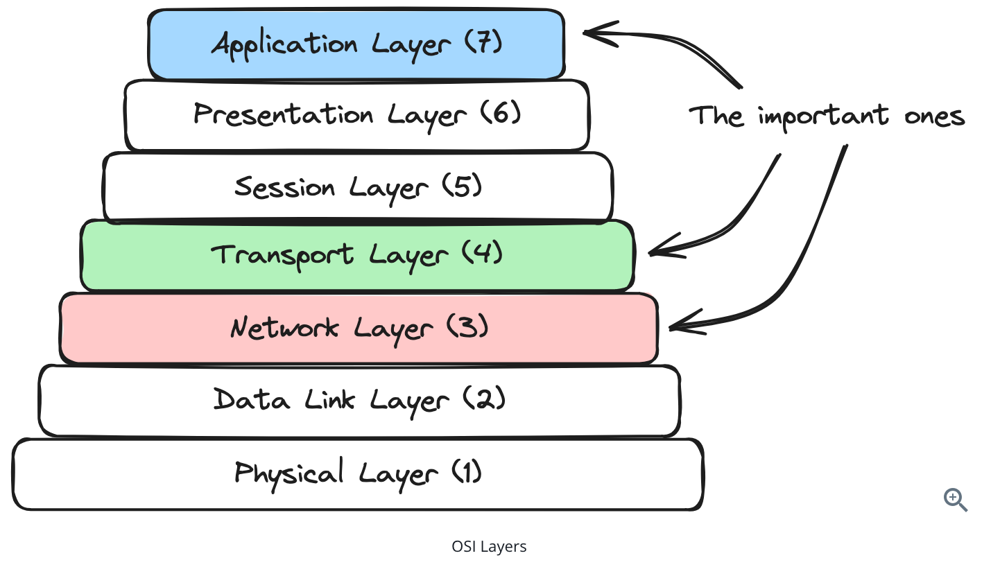

# Networking Essentials

## Networking Layers

The Open Systems Interconnection (OSI) model is a conceptual framework created by the ISO that standardizes network communication into seven distinct layers. While the full networking stack is fascinating, there are three key layers that come up most often in system design interviews.



1. **Application Layer** - Deals with application protocols like DNS, HTTP, Websockets, WebRTC. These are common protocols that build on top of TCP  (or UDP, in the case of WebRTC) to provide a layer of abstraction for different types of data typically associated with web applications.
2. **Transport Layer** - Deals with end-to-end communication protocols like TCP, QUIC or UDP. This layer provides reliability, ordering and flow control.
3. **Network Layer** - At this layer is IP, the protocol that handles routing and addressing. It's responsible for breaking the data into packets, handling packet forwarding between networks, and providing best-effort delivery to any destination IP address on the network.

## Network Layer Protocols 

1. This layer is dominated by the IP protocol, which is responsible for routing and addressing. 
2. In a system, nodes are assigned IPs usually by a DHCP server when they boot up. These IP addresses are arbitrary.
3. If I want to, I can create a private network with my servers and give them any IP address I want, but if we want internet traffic to be able to find them we will need to use IP addresses that are routable and allocated by a Regional Internet Registry (RIR). These assigned IP addresses are called public IPs and are used to identify devices on the Internet.

#### Network Topology and Isolation

At Staff level you're expected to be fluent in how networks are carved up, not just that public and private IPs exist.

1. **CIDR blocks**: IP ranges are expressed in CIDR notation (e.g. `10.0.0.0/16`). The number after the slash is how many leading bits are fixed as the network prefix; the remaining bits are host addresses. A `/16` gives you ~65k addresses, a `/24` gives you 256. This is how you size subnets.
2. **VPC and subnets**: A Virtual Private Cloud is an isolated network in a cloud provider. You divide it into subnets — typically **public subnets** (have a route to an internet gateway) and **private subnets** (no direct inbound internet route). Databases and internal services live in private subnets; load balancers and bastion hosts live in public ones.
3. **NAT (Network Address Translation)**: Lets many hosts with private IPs share a single public IP for outbound traffic. A **NAT gateway** allows instances in a private subnet to reach the internet (e.g. to pull dependencies) without being directly reachable from it. NAT is also why peer-to-peer connections are hard — it's the core problem WebRTC's signaling and STUN/TURN servers work around.
4. **Security groups and network ACLs**: These are two firewall layers that operate at different granularities. Both filter on protocol + port + source/destination, but they differ in what they attach to and — crucially — what they can express.
   - **Security groups do the real tier isolation.** A security group attaches to an *instance* (or a load balancer, database, etc.) and acts as its personal firewall. Its defining ability is that a rule's *source* can be **another security group**, not just an IP range — so you authorize traffic by *role* rather than by address. This is what actually enforces the "LB → app → DB" chain:
     - Load balancer's group (`sg-lb`): allow inbound TCP 443 from the internet.
     - App tier's group (`sg-app`): allow inbound TCP 8080 **from `sg-lb`**.
     - Database's group (`sg-db`): allow inbound TCP 5432 **from `sg-app`**.
     
     Because `sg-db` only accepts traffic *from members of `sg-app`*, nothing else in the VPC — not even something in the same subnet — can reach the database. Security groups are also **stateful** (allow an inbound request and its response is automatically allowed back out) and **allow-only** (everything not listed is denied). In typical practice this tiering is enforced entirely by security groups.
   - **Network ACLs are a coarse subnet-level backstop** — they do *not* express the role-based chain above. A NACL attaches to a *subnet* and only understands **IP/CIDR ranges**, so it has no concept of "the app tier"; the closest it gets is a subnet CIDR, which is coarser and brittle. What it adds that security groups can't is explicit **deny** rules (security groups are allow-only) — e.g. "this private subnet may never receive traffic from the public internet" or "blocklist this one bad CIDR." NACLs are also **stateless**: each packet is evaluated in isolation, so if you write NACL rules you must open *both* directions, including the **outbound ephemeral port range (~1024–65535)** for return traffic — a classic gotcha that doesn't exist with stateful security groups.
   - The mental model: **security groups** are the fine-grained, role-based locks that build the LB→app→DB chain (stateful, allow-only, can reference other groups); **network ACLs** are the optional coarse guard at the subnet perimeter (stateless, CIDR-only, but able to explicitly deny). The chain is a security-group story; the NACL is defense-in-depth around the edges, and most teams leave it at its default "allow all."
5. **IPv4 vs IPv6**: **IPv4** uses 32-bit addresses (e.g. `192.168.1.1`), giving ~4.3 billion addresses — long since exhausted, which is exactly why NAT and private address ranges exist. **IPv6** uses 128-bit addresses (e.g. `2001:0db8:85a3::8a2e:0370:7334`), an effectively unlimited pool, so every device can have a globally unique address and NAT becomes unnecessary. In practice the two coexist via **dual-stack** (hosts run both), and you'll most often meet IPv6 at the edge — CDNs, load balancers, and mobile carriers frequently terminate IPv6 from clients and talk IPv4 internally. Worth knowing they're not interoperable on the wire (an IPv4-only host can't talk directly to an IPv6-only host without a translation layer).

## DNS: Turning Names into Addresses

The Domain Name System resolves human-readable names (`api.example.com`) into IP addresses. It's technically an application-layer protocol (usually over UDP port 53, falling back to TCP for large responses, and increasingly over TLS/HTTPS as DoT/DoH), but it underpins essentially every other protocol here.

Resolution walks a hierarchy, and each step is cached according to the record's TTL:

1. The client checks its local/OS cache, then asks a **recursive resolver** (often your ISP's or a public one like `8.8.8.8`).
2. If the resolver doesn't have the answer cached, it queries the **root** nameservers, which point it to the **TLD** nameservers (`.com`), which point it to the domain's **authoritative** nameservers.
3. The authoritative server returns the record, which is cached at each layer for the duration of its **TTL**.

Key record types worth knowing:

- **A / AAAA**: Name → IPv4 / IPv6 address.
- **CNAME**: An alias from one name to another name.
- **NS**: Delegates a zone to a set of nameservers.
- **MX**: Mail servers for a domain.

Two DNS concepts come up constantly in system design:

1. **TTL trade-off**: Low TTLs let you fail over or change infrastructure quickly but increase query load and latency; high TTLs are efficient but mean stale records linger. This is exactly why DNS-based load balancing (line above) can only tolerate *slow* updates.
2. **GeoDNS and anycast**: DNS can return different answers based on the client's location, steering users to the nearest region. Combined with **anycast** (many physical servers advertising the *same* IP via BGP, so packets route to the nearest one), this is the foundation of how CDNs and global services get you to a close-by point of presence.

## Transport Layer Protocols

The transport layer is where we establish end-to-end communication between applications. They give us some guarantees instead of handing us a jumbled mess of packets. The three primary protocols at this layer are TCP, UDP, and QUIC, each with distinct characteristics that make them suitable for different use cases.

### UDP: Fast but unreliable

User Datagram Protocol (UDP) offers few features on top of IP but is very fast. Spray and pray is the right way to think about this. It provides a simpler, connectionless service with no guarantees of delivery, ordering, or duplicate protection.

Key characteristics of UDP include:

1. **Connectionless**: No handshake or connection setup
2. **No guarantee of delivery**: Packets may be lost without notification
3. **No ordering**: Packets may arrive in a different order than sent
4. **Lower latency**: Less overhead means faster transmission
5. **Lack of Browser support**: Browsers don't have widespread support for UDP yet outside of WebRTC 

UDP is perfect for applications where speed is more important than reliability, such as live video streaming, online gaming, VoIP, and DNS lookups. In these cases the application or client is equipped to handle the occasional packet loss or out of order packet. For VOIP as an example, the client might just drop the occasional packet leading to a hiccup in the audio but overall the conversation is still intelligible. This is vastly preferable to retransmitting those lost packets and clogging up the network with ACKs. 

### TCP: Reliable but with Overhead

Transmission Control Protocol (TCP) is the workhorse of the internet. It provides reliable, ordered, and error-checked delivery of data. It establishes a connection through a three-way handshake and maintains that connection throughout the communication session.

This connection is called a "stream" and is a stateful connection between the client and server. TCP will ensure that recipients of messages acknowledge their receipt and, if they don't, will retransmit the message until it is acknowledged.

**3-way handshake** between the client and server to initiate a TCP connection: 
1. **SYN**: The client sends a SYN (synchronize) packet to the server to request a connection.
2. **SYN-ACK**: The server responds with a SYN-ACK (synchronize-acknowledge) packet to acknowledge the request.
3. **ACK**: The client sends an ACK (acknowledge) packet to establish the connection.

The cost of this handshake is one full round trip (RTT) *before any data is sent*. Over HTTPS you then pay for the TLS handshake on top, which is why connection reuse (keep-alive) and protocols that fold these together (TLS 1.3, QUIC) matter so much for latency.

After the data transfer is complete, the client and server close the TCP connection using a **four-way handshake**.
1. **FIN**: The client sends a FIN (finish) packet to the server to terminate the connection.
2. **ACK**: The server acknowledges the FIN packet with an ACK.
3. **FIN**: The server sends a FIN packet to the client to terminate its side of the connection.
4. **ACK**: The client acknowledges the server's FIN packet with an ACK.

In practice the two middle steps often coalesce: the server can piggyback its FIN onto the ACK, so the close looks like FIN → FIN-ACK → ACK.

Key Characteristics of TCP: 

1. **Connection-oriented**: Establishes a dedicated connection before data transfer
2. **Reliable delivery**: Guarantees that data arrives in order and without errors
3. **Flow control**: Prevents overwhelming receivers with too much data
4. **Congestion control**: Adapts to network congestion to prevent collapse
5. TCP is ideal for applications where data integrity is critical — that is, basically everything where UDP is not a good fit.

#### What Flow and Congestion Control Actually Do

These are two different problems that TCP solves and that interviewers like to pull apart:

- **Flow control** protects the *receiver*. Each side advertises a **receive window** (how much unacknowledged data it's willing to buffer). The sender never has more than a window's worth of data in flight, so a fast sender can't overwhelm a slow receiver.
- **Congestion control** protects the *network*. TCP maintains a separate **congestion window** and probes for available bandwidth: it starts small (**slow start**, growing exponentially), then switches to linear growth, and backs off when it detects loss. The algorithm that governs this has evolved — **CUBIC** (loss-based, the common default) versus **BBR** (models bandwidth and RTT directly, better on lossy or high-latency links). The effective throughput is the *minimum* of the two windows.

One more classic: **Nagle's algorithm** buffers tiny writes to send fewer, fuller packets, which improves efficiency but adds latency. Latency-sensitive workloads (games, RPC) disable it with `TCP_NODELAY`.

#### Head-of-Line (HoL) Blocking

Because TCP guarantees ordered delivery, a single lost packet stalls *everything* behind it in the stream until it's retransmitted — even data that has already arrived. This is **head-of-line blocking**, and it shows up at multiple layers of the stack:

- **TCP level**: one dropped segment blocks the whole connection.
- **HTTP/2**: multiplexes many logical streams over one TCP connection, so a single lost packet blocks *all* of them (HTTP/2 fixed application-level HoL blocking but not the transport-level version).
- **The fix**: **QUIC** (below) runs independent streams over UDP so a loss in one stream doesn't stall the others.

### QUIC: Reliability Without TCP's Baggage

QUIC is a transport protocol built on top of UDP that delivers TCP-like reliability while avoiding several of its structural problems. It's the transport underneath **HTTP/3**.

Key characteristics of QUIC include:

1. **UDP-based, reliable**: It reimplements ordering, retransmission, and congestion control in userspace on top of UDP, so it gets TCP's guarantees without being tied to TCP's kernel implementation (which means it can evolve without OS upgrades).
2. **No transport-level head-of-line blocking**: Independent streams are truly independent — packet loss in one stream doesn't stall the others.
3. **Faster handshakes**: TLS 1.3 is built directly into the protocol, so connection setup and encryption negotiate together in **1 RTT** (or **0-RTT** for resumed connections), versus TCP's separate TCP + TLS handshakes.
4. **Connection migration**: Connections are identified by a connection ID rather than the 4-tuple of IPs and ports. A client can change networks (Wi-Fi to cellular, IP change behind NAT) and keep the same connection alive — a big deal for mobile.

Use QUIC/HTTP-3 when you want the latency and mobility benefits above, especially for user-facing web and mobile traffic on lossy networks. The main trade-offs are that UDP is sometimes throttled or blocked by middleboxes, and that userspace implementations can be more CPU-intensive than kernel TCP.

## Application Layer Protocol

These protocols define how applications communicate and are built on top of Transport Layer protocols. 

### HTTP/HTTPS: The Web's Foundation

Hypertext Transfer Protocol (HTTP) is the de-facto standard for data communication on the web. It's a request-response protocol where clients send requests to servers, and servers respond with the requested data. HTTP is a stateless protocol. Each request is independent and the server doesn't need to maintain any information about previous requests. 

HTTPS adds a security layer (TLS/SSL) to encrypt communications, protecting against eavesdropping and man-in-the-middle attacks. If you're building a public website you're going to be using HTTPS without exception. Generally speaking this means that the contents of your HTTP requests and responses are encrypted and safe in transit.

#### The TLS Handshake

TLS is worth understanding beyond "it encrypts things," because it explains a lot of latency and architecture decisions. After the TCP connection is established, TLS negotiates a secure channel:

1. **ClientHello / ServerHello**: The client and server agree on a TLS version and cipher suite.
2. **Certificate exchange**: The server presents its certificate, which the client validates against a trusted Certificate Authority (this is what proves the server is who it claims to be and defeats man-in-the-middle attacks).
3. **Key exchange**: Both sides use asymmetric cryptography to agree on a shared **symmetric** session key, which is then used to encrypt the actual data (symmetric crypto is far cheaper per byte).

**TLS 1.3** cut the handshake down to a single round trip (**1-RTT**), and supports **0-RTT** resumption for returning clients — a major latency win over TLS 1.2's two round trips.

**Where termination happens** matters in design. TLS is often terminated at the edge — a load balancer, reverse proxy, or CDN decrypts the request and forwards it onward. This is exactly why an L7 load balancer can read HTTP content (it holds the certificate and terminates the connection). Traffic beyond that point is either plaintext inside a trusted network or re-encrypted; when services encrypt traffic *between* each other with mutual certificate validation, that's **mTLS**, commonly handled by a service mesh.

#### HTTP Versions

The HTTP semantics (methods, status codes, headers) are stable, but how bytes move on the wire has evolved significantly — and the differences are among the most commonly probed networking topics:

- **HTTP/1.1**: One request at a time per connection. **Keep-alive** lets a connection be reused across requests (avoiding repeated TCP + TLS handshakes), but requests are still serialized — a slow response blocks the ones behind it (application-level head-of-line blocking). Browsers work around this by opening ~6 parallel connections per host.
- **HTTP/2**: Introduces **multiplexing** — many concurrent streams over a single TCP connection — plus header compression (HPACK) and server push. This solves HTTP/1.1's serialization, but because it all rides one TCP connection, a single lost packet still stalls every stream (transport-level HoL blocking).
- **HTTP/3**: Runs over **QUIC** (see the transport section) instead of TCP, eliminating transport-level head-of-line blocking and getting faster handshakes and connection migration for free.

HTTP includes a few key concepts like

1. **Request Methods** - GET, PUT, POST, PATCH, DELETE
    * PUT - Update data on the server
    * PATCH - Update a resource partially
    * PUT replaces the entire resource while PATCH updates part of a resource. Clients typically send the full object with PUT while clients only send the changed fields as part of PATCH. 
2. **Status Codes** 
    * SUCCESS (2xx)
    * Moved (3xx)
    * Client errors (4xx)
    * Server errors (5xx)
3. **Headers** - Metadata about the request or response
4. **Body** - The actual content being transferred

### REST: Simple and Flexible

Representational State Transfer (REST) is an architectural style for designing APIs. It defines principles (opinions) such as:

1. Resources should have URLs
2. Use HTTP methods meaningfully
3. Stateless communication
4. Standard representations (usually JSON)

REST is the most common API paradigm you'll use in system design interviews. It's a simple and flexible way to create APIs that are easy to understand and use. The core principle behind REST is that clients are often performing simple operations against resources (think of them like database tables or files on a server).

REST is what we should think by default when answering system-design interview questions. However, REST is not going to be the most performant solution for very high throughput services, and generally speaking JSON is a pretty inefficient format for serializing and deserializing data.

### GraphQL : Flexible Data Fetching

GraphQL is an API paradigm that allows clients to request exactly the data they need. When the frontend team wants to display a new page, they can either

1. Cobble together a bunch of different requests to backend endpoints (imagine querying 1 API for a list of users and making 10 API calls to get their details
2. Create huge aggregation APIs which are hard to maintain and slow to change
3. Write brand new APIs for every new page they want to display. 

None of these are particularly good solutions but it's easy to run into them with a standard REST API. The problem with under-fetching is that you may need multiple requests and round trips. This adds overhead and latency to the page load. Over-fetching is the opposite: when we pack way more than we need in an API response to guard ourselves against future use-cases that we don't have today. It means that APIs take a long time to load and return too much data.

GraphQL solves these problems by allowing the frontend team to flexibly query the backend for exactly the data they need. The backend can then respond with the data in the shape that the frontend needs it. This is a great fit for mobile apps and other use-cases where you want to reduce the amount of data transferred.

In most GraphQL architectures, there is a GraphQL server (or GraphQL gateway) sitting between the client and the backend services.

```
Client (Web/Mobile)
    |
    | GraphQL Query
    v
GraphQL Server
    |
    +--> User Service
    |
    +--> Product Service
    |
    +--> Order Service
    |
    +--> Database
```

The GraphQL server receives this query and then:

1. Parses and validates it.
2. Determines which fields are requested.
3. Invokes resolver functions.
4. Fetches data from one or more backend systems.
5. Combines the results.
6. Returns a single JSON response.

GraphQL is a great fit for use-cases where the frontend team needs to iterate quickly and adjust. They can flexibly query the backend for exactly the data they need. On the other hand, execution of these GraphQL queries can be a source of latency and complexity for the backend — sometimes involving the same bespoke backend code that we're trying to avoid. In practice, GraphQL finds its sweet spot with complex clients and when multiple teams are making wide queries to overlapping data.

### gRPC: Efficient Service Communication 

gRPC is a high-performance RPC (Remote Procedure Call) that uses HTTP/2 and Protocol Buffers.

Think of Protocol Buffers like JSON but with a more rigid schema that allows for better performance and more efficient serialization.

gRPC builds on this to provide service definitions. These definitions are compiled into a client and server stub which a wide variety of languages and frameworks can consume to build clients and services. 

gRPC shines in microservices architectures where services need to communicate efficiently. Its strong typing helps catch errors at compile time rather than runtime, and its binary protocol is more efficient than JSON over HTTP. 

Consider gRPC for internal service-to-service communication, especially when performance is critical or when latencies are dominated by the network rather than the work the server is doing. Having internal APIs using gRPC and external APIs using REST is a great way to get the benefits of a binary protocol without the complexity of a public-facing API. 

In many interviews, using REST both for internal and external APIs is fine and you can build from there depending on the needs of the problem and probes from your interviewer.

### Server Sent Events (SSE) : Real-time Push Communication

SSE is a nice hack on top of HTTP that allows a server to stream many messages, over time, in a single response from the server. With most HTTP APIs you'd get a single, cohesive JSON blob as a response from the server that is processed once the whole thing has been received. Since we have to wait for the whole response to come in before we can process it, it's not much good for push notifications! On the other hand, with SSE, the server can push many messages as "chunks" in a single response from the server. Clients can then process each message as it comes in. It's still one big HTTP response (same TCP connection), but it comes in over many smaller packets and clients are expected to process each line of the body individually to allow them to react to the data as it comes in.

We can't keep an SSE connection open for too long because the server (or the load balancer, or a middle box proxy) will close down the connection. So the SSE standard defines the behavior of an `EventSource` object that, once the connection is closed, will automatically reconnect with the ID of the last message received. Servers are expected to keep track of prior messages that may have been missed while the client was disconnected and resend them.

Use this pattern in system design inteviews where you want clients to get notifications or events as soon as they happen. For example - Real-time online bidding. 

### WebSockets: Real-Time Bidirectional Communication

WebSockets provide a persistent, TCP-style connection between client and server, allowing for real-time, bidirectional communication with broad support (including browsers). Unlike HTTP's request-response model, WebSockets enable servers to push data to clients without being prompted by a new request. Similarly clients can push data back to the server without the same wait.

WebSockets are initiated via an HTTP "upgrade" protocol, which allows an existing TCP connection to change L7 protocols. This is super convenient because it means you can utilize some of the existing HTTP session information (e.g. cookies, headers, etc.) to your advantage. 

Here is how clients and servers establish WebSocket connections:

1. Client initiates WebSocket handshake over HTTP (with a backing TCP connection)
2. Connection upgrades to WebSocket protocol, WebSocket takes over the TCP connection
3. Both client and server can send binary messages to each other over the connection
4. The connection stays open until explicitly closed

Once the connection has been established, you effectively have a channel where you can send binary packets to the server from the client and vice versa. 

You suggest WebSockets when you need high-frequency, persistent, bi-directional communication between the server and the client. Some use cases are real-time applications and games where you need to exchange messages as soon as they happen.

### WebRTC: Peer-to-Peer Communication

WebRTC enables direct peer-to-peer communication between browsers without requiring an intermediary server for the data exchange. This works over UDP. From a networking perspective, establishing peer-to-peer connections is more difficult than client-server interactions because most clients don't allow inbound connections for security reasons.

With WebRTC, clients talk to a central "signaling server" which keeps track of which peers are available together with their connection information. Once a client has the connection information for another peer, they can try to establish a direct connection without going through any intermediary servers.

WebRTC is ideal for audio/video calling and conferencing applications. It can also occasionally be appropriate for collaborative applications like document editors, especially if they need to scale to many clients. In practice, most collaborative editors don't require scaling to thousands of clients. Additionally, you often need a central server anyways to store the document and coordinate between clients. 

### Choosing a Real-Time Transport

In an interview the choice usually comes down to *who needs to push data, how often, and in which direction*. Lining the options up side by side is the fastest way to justify a pick:

| Option | Direction | Transport | Best for | Watch out for |
|---|---|---|---|---|
| **Long polling** | Client pulls, server holds | HTTP | Simple, occasional updates; universal support | Wasteful under high frequency; latency of a full request cycle |
| **SSE** | Server → client only | HTTP (one long response) | Feeds, notifications, live scores, bidding updates | Unidirectional; connection limits per host on HTTP/1.1 |
| **WebSocket** | Full duplex | TCP (via HTTP upgrade) | Chat, multiplayer games, collaborative editing | Stateful — needs sticky routing (L4 LB / least-connections) |
| **WebRTC** | Peer-to-peer (or via relay) | UDP | Audio/video, low-latency media between clients | NAT traversal complexity; needs signaling + STUN/TURN |
| **gRPC streaming** | Server / client / bidi | HTTP/2 | Internal service-to-service streaming | Not natively browser-friendly; better inside the datacenter |

Default reasoning: need server→client push only → **SSE**; need true bidirectional → **WebSocket**; peer media → **WebRTC**; internal service streams → **gRPC**. Reach for long polling only when you need something that works everywhere with zero special infrastructure.

### Scaling Persistent Connections

Establishing a WebSocket or SSE connection is the easy part. The question interviewers actually push on is: *you have 1M users connected across 100 servers — user A sends a message to a room, how does it reach user B who's connected to a different server?* Because these connections are **stateful and sticky**, the recipient is almost never on the same server as the sender, so you can't just look them up in local memory.

Two pieces solve this:

1. **A connection registry**: a mapping of *which user is connected to which server* (often in Redis, or a service like ZooKeeper), so any server can find where a target user lives. Connections are ephemeral, so this needs a TTL/heartbeat to reap dead entries.
2. **A backplane (pub/sub fan-out)**: when a server receives a message it needs to deliver to connections it doesn't hold, it publishes to a shared bus — **Redis pub/sub** or a broker like **Kafka** — and every server subscribes and pushes to *its own* connected clients. This decouples "which server received the message" from "which servers hold the recipients."

Staff-level nuances worth raising:

- **Fan-out cost**: naive Redis pub/sub broadcasts every message to *every* server, which doesn't scale for many small rooms. Sharding channels by room (or using a broker with per-topic subscriptions) limits fan-out to servers that actually hold members of that room.
- **Connection capacity**: a single server can hold tens to hundreds of thousands of open connections (bounded by memory and file descriptors, not CPU), so you scale connection count horizontally and size the fleet by concurrent connections, not request rate.
- **Reconnect storms**: if a server dies, all its connections reconnect *at once* and slam the remaining fleet — the same thundering-herd problem as retries. Clients need jittered reconnect backoff (the `EventSource` last-event-ID behavior for SSE is the graceful version of this), and the load balancer should use **least-connections** (per the algorithm section) so the reconnecting flood spreads evenly.

## Load Balancing 

We need to spread the incoming requests (load) by deciding which server should handle each request. There's two ways to handle load balancing: on the client side or on the server side. 

### Client-side Load Balancing 

With client-side load balancing, the client itself decides which server to talk to. Usually this involves the client making a request to a service registry or directory which contains the list of available servers. Then the client makes a request to one of those servers directly. The client will need to periodically poll or be pushed updates when things change.

Client-side load balancing can be very fast and efficient. Since the client is making the decision, it can choose the fastest server without any additional latency. Instead of using a full network hop to get routed to the right server on every request, we only need to (periodically) sync our list of servers with the server registry.

Client-side load balancing can work great in two different scenarios: either

1. We have a small number of clients that we control, (e.g. the Redis Cluster client, or gRPC's client-side load balancing for internal services) or
2. We have a large number of clients but we can tolerate slow updates (e.g. DNS).

### Dedicated Load Balancer 

We may not want our clients to have to refresh their list of servers or even know about the existence of multiple servers on the backend. Or we might have a large number of clients that we don't control but need to retrieve updates quickly. In these cases, we'll use a dedicated load balancer: a server or hardware device that sits between the client and the backend servers and makes decisions about which server to send the request to.

Having a dedicated load balancer implies an additional hop in each request: first to the load balancer, then to the server which needs to serve the request. But in exchange we get very fast updates to our list of servers and fine-grained control over how we route requests.

Load balancers can operate at different layers of the protocol stack and which you choose will depend, in part, on what your application needs.

1. Layer 4 Load Balancer
   - Layer 4 load balancers operate at the transport layer (TCP/UDP).
   - They make routing decisions based on network information like IP addresses and ports, without looking at the actual content of the packets.
   - Maintain persistent TCP connections between client and server.
   - Are fast and efficient due to minimal packet inspection.
   - Cannot make routing decisions based on application data.
   - Are typically used when raw performance is the priority.
   - If a client establishes a TCP connection through an L4 load balancer, that same server will handle all subsequent requests within that TCP session. This makes L4 load balancers particularly well-suited for protocols that require persistent connections, like WebSocket connections.
2. Layer 7 Load Balancer
   - Layer 7 load balancers operate at the application layer, understanding protocols like HTTP.
   - They can examine the actual content of each request and make more intelligent routing decisions.
   - Unlike Layer 4 load balancers, the connection-level details are not that relevant. Layer 7 load balancers receive an application-layer request (like an HTTP GET) and forward that request to the appropriate backend server.
   - Terminate incoming connections and create new ones to backend servers.
   - Can route based on request content (URL, headers, cookies, etc.).
   - More CPU-intensive due to packet inspection.
   - Provide more flexibility and features.
   - Better suited for HTTP-based traffic.

### Health Checks

Health checks are a way for the load balancer to determine if a server is healthy. They can be configured to check the server at different intervals and with different protocols. A common approach is to use a TCP health check, which is a simple and efficient way to check if a server is accepting new connections. A Layer 7 health check might make an HTTP request to the server and make sure the response is success (e.g. a 200 status code vs a 500 indicating internal failures or no response indicating a crash).

A few refinements separate a Staff-level answer here:

- **Active vs passive checks**: Active checks proactively poll a health endpoint on an interval. Passive checks (**outlier detection**) observe *real* traffic and eject a server that starts returning errors or timing out, without waiting for the next poll. Good systems use both.
- **Shallow vs deep checks**: A shallow check confirms the process is up; a deep check verifies dependencies (DB, cache) are reachable. Deep checks catch more, but be careful — if every instance's health check fails because a shared dependency blips, the LB can eject the *entire* fleet at once. Prefer failing shallow and shedding load over cascading a dependency outage into a total outage.
- **Graceful draining**: On deploy or scale-down, a server should be marked "draining" so the LB stops sending it *new* connections while letting existing ones finish (**connection draining**). This is what makes zero-downtime deploys possible, and it matters most for long-lived connections like WebSockets and SSE.

### Load Balancing Algorithms

1. Round Robin: Requests are distributed sequentially across servers
2. Random: Requests are distributed randomly across servers
3. Least Connections: Requests go to the server with the fewest active connections
4. Least Response Time: Requests go to the server with the fastest response time
5. IP Hash: Client IP determines which server receives the request (useful for session persistence)

Round Robin or Random Algorithms are appropriate for stateless applications. For services that require a persistent connection (e.g. those serving SSE or WebSocket connections), using Least Connections is a good idea because it avoids a situation where a single server gradually accumulates all of of the active connections.

## Edge and Connection Infrastructure

A load balancer is one piece of a larger edge story. At Staff level you're expected to know where cross-cutting concerns actually live and how connections are managed at scale.

### Connection Pooling and Port Exhaustion

Opening a TCP (and TLS) connection is expensive — a handshake and at least one round trip before any useful work happens. **Connection pooling** keeps a set of established connections open and reuses them across requests, which is why HTTP keep-alive and database connection pools exist.

A classic real-world scaling bug lurks here: **ephemeral port exhaustion**. Each outbound connection from a host consumes a source port from a finite range (~28k by default). A service that opens a fresh connection per request to a downstream — or an L4 load balancer fronting a busy backend — can run out of ports and start failing connections even though CPU and memory look fine. The fix is pooling and connection reuse. This is the kind of failure mode that distinguishes a senior answer from a staff one.

### Forward vs Reverse Proxy

Both are intermediaries that sit between a client and a server, but they face opposite directions and serve opposite parties — a distinction interviewers like to check.

- **Forward proxy**: Sits in front of the **clients** and acts on their behalf. The client knows it's talking to a proxy; the destination server sees the proxy's IP, not the client's. Used for outbound control — corporate egress filtering, content policy, caching shared downloads, and anonymity (a VPN is essentially a forward proxy).
- **Reverse proxy**: Sits in front of the **servers** and acts on their behalf. The client thinks it's talking directly to the service and has no idea how many servers are behind it. Used for inbound concerns — load balancing, TLS termination, caching, and as the home for the API gateway and edge security discussed above.

The rule of thumb: a forward proxy hides the **client** from the server; a reverse proxy hides the **server** (fleet) from the client.

```
FORWARD PROXY (acts for clients, controls outbound)

  [Client A] ┐
  [Client B] ┼──▶ [Forward Proxy] ──▶ Internet ──▶ [Any Server]
  [Client C] ┘     (egress filter,                 (sees proxy IP,
                    cache, anonymity)                not the clients)


REVERSE PROXY (acts for servers, controls inbound)

                                        ┌──▶ [Server 1]
  [Client] ──▶ Internet ──▶ [Reverse ───┼──▶ [Server 2]
   (thinks it's talking      Proxy]     └──▶ [Server 3]
    to one server)      (LB, TLS term,
                         cache, WAF,
                         API gateway)
```

In a real-world request, both can be present: a corporate user's traffic exits through the company's **forward proxy**, crosses the internet, and arrives at the service's **reverse proxy** (CDN → API gateway → load balancer) before reaching an app server.

### Reverse Proxies, API Gateways, and Service Mesh

- **Reverse proxy**: Sits in front of your servers and forwards requests to them. It's the general category that L7 load balancers, caches, and TLS terminators fall into (NGINX, Envoy).
- **API gateway**: A reverse proxy specialized for API traffic. It's the single front door for external clients and is where you centralize cross-cutting concerns — authentication, rate limiting, request routing, API versioning, and request/response transformation — so individual services don't each reimplement them.
- **Service mesh**: For *internal* service-to-service traffic, a mesh pushes these concerns (mTLS, retries, timeouts, circuit breaking, observability) into a **sidecar proxy** (e.g. Envoy) deployed next to each service. Application code stays business-logic-only while the mesh handles the networking. The trade-off is real operational complexity, so reach for it when you have enough services that reimplementing these patterns everywhere is the bigger cost.

### The Tools: NGINX and Envoy

When these abstractions show up in practice, two names dominate — it helps to know what they actually are and when each is reached for.

- **NGINX**: A battle-tested, high-performance web server and reverse proxy. It's the workhorse for serving static content, TLS termination, L7 load balancing, and caching, and it's ubiquitous as the reverse proxy in front of a web app or as an ingress controller in Kubernetes. Configuration is traditionally file-based (`nginx.conf`) and reloaded on change, which is simple and rock-solid for relatively **static** topologies. People reach for NGINX when they want a proven, low-overhead front door without much moving underneath it.
- **Envoy**: A modern L7 proxy built for **dynamic, cloud-native** environments. Its defining feature is a set of **dynamic APIs (xDS)** that let a control plane push configuration — endpoints, routes, policies — at runtime *without restarts*, which is exactly what you need when services and instances are constantly appearing and disappearing. It has first-class support for HTTP/2, gRPC, rich observability, retries, and circuit breaking. This is why Envoy is the default **sidecar** in service meshes (e.g. Istio) and a common API gateway: the mesh's control plane programs each Envoy on the fly.

The quick heuristic: **NGINX** for a straightforward, stable reverse proxy / web server at the edge; **Envoy** when you need dynamic service discovery, gRPC, and deep observability — especially as the data plane of a service mesh. (Both are far more capable than this summary; the point is knowing which one an interviewer expects you to name in a given context.)

### CDNs and Anycast

A **Content Delivery Network** caches content at points of presence (PoPs) physically close to users, cutting latency and offloading origin servers. Static assets are the obvious case, but modern CDNs also cache API responses, terminate TLS at the edge, and run logic (edge functions) close to users.

Users are steered to the nearest PoP via **GeoDNS** (return a location-appropriate IP) and **anycast** (many PoPs advertise the same IP via BGP, so the network routes each packet to the closest one). Anycast also absorbs traffic spikes and DDoS by spreading load across many locations. This ties directly back to the DNS section — the CDN is one of the biggest consumers of GeoDNS and low-TTL records.

### HTTP Caching

A CDN is only as good as the caching semantics that tell it what to store and for how long. These are HTTP headers, and they apply to *any* cache in the path — browser, CDN, or reverse proxy:

- **`Cache-Control`** is the primary control. `max-age=<seconds>` sets how long a response is fresh; `no-store` forbids caching entirely (use for sensitive/personalized data); `private` allows the browser to cache but not shared caches like a CDN, while `public` allows both.
- **Validation with `ETag`**: The server tags a response with an `ETag` (a version fingerprint). Once the cached copy is stale, the client revalidates with `If-None-Match: <etag>`; if nothing changed, the server returns a tiny **304 Not Modified** with no body instead of resending the payload. `Last-Modified` / `If-Modified-Since` is the timestamp-based equivalent.
- **Cache key**: What identifies a cached entry — usually method + URL, extended via the `Vary` header (e.g. `Vary: Accept-Encoding` so a gzipped and an uncompressed response aren't confused). Getting the key wrong is how one user gets served another user's personalized page.

The mental model to state in an interview: **`max-age` avoids the request entirely** (served straight from cache), while **`ETag` avoids re-sending the body** (you still pay a round trip but skip the payload). The two layer together — fresh content skips the network, stale-but-unchanged content skips the download.

**Compression** rides alongside caching: clients advertise `Accept-Encoding: gzip, br` and servers compress the response body (**brotli** generally beats **gzip** on text). It's a cheap, large win for text payloads like JSON and HTML — and largely pointless on already-compressed formats like images or video.

## Network Security

TLS/mTLS (covered earlier) protects data *in transit*, but the edge has a broader security surface an interviewer may probe. This isn't a security deep-dive — just the networking-adjacent pieces you're expected to place correctly.

- **DDoS mitigation**: The goal is to absorb or filter malicious traffic before it reaches your origin. **Anycast** (from the CDN section) spreads a volumetric attack across many PoPs so no single location is overwhelmed. **Rate limiting** at the edge caps abusive clients. Layers matter: volumetric floods (L3/L4) are absorbed by the network and scrubbing centers, while application-layer attacks (L7, e.g. expensive query floods) are caught higher up.
- **WAF (Web Application Firewall)**: Sits at the edge (often bundled with the CDN or API gateway) and inspects L7 traffic for malicious patterns — SQL injection, XSS, known exploit signatures — rejecting them before they hit your services. It's the natural companion to the API gateway you already centralize concerns in.
- **CORS (Cross-Origin Resource Sharing)**: A browser-enforced rule, not a server firewall — a constant source of confusion. By default the browser's **same-origin policy** blocks a page on `a.com` from reading a response from `b.com`. The server at `b.com` opts specific origins back in with `Access-Control-Allow-Origin` headers, and for non-simple requests the browser first sends a **preflight** `OPTIONS` request to check what's allowed. The key insight for an interview: CORS is enforced by the *browser* and only affects browser-originated requests — it's not a server-side access control mechanism, and server-to-server calls ignore it entirely.

## Reliability Patterns

Knowing *that* a protocol exists is table stakes; knowing how a distributed system degrades and how to keep a local failure from becoming a global one is what interviewers use to separate senior from Staff. These patterns show up in almost every design discussion.

### Timeouts, Retries, and Backoff

- **Timeouts**: Every network call must have one. A call with no timeout holds a connection (and a thread, and a slot in every pool along the path) indefinitely when a downstream hangs — this is how one slow dependency exhausts resources and takes down callers.
- **Retries** paper over transient failures, but naive retries are dangerous. If a downstream is struggling and every client retries immediately, the retries pile on load exactly when the system can least handle it — a **retry storm** that turns a blip into a cascading outage.
- **Exponential backoff with jitter**: Space retries out at growing intervals (1s, 2s, 4s…) and add randomness so clients don't all retry in lockstep ("thundering herd"). Cap the number of retries and the total time. This is the correct default for retrying anything.

**A worked retry storm.** Say 1,000 clients call a service that normally handles 1,000 req/s comfortably. The service has a bad moment — a GC pause, a slow query — and latency spikes so a slice of requests time out. Each client is configured to retry up to 3 times. The failing requests now become 2× or 3× the requests, so the moment the service is *most* overloaded, offered load jumps from 1,000 to 3,000 req/s. That extra load causes more timeouts, which cause more retries — a feedback loop that keeps the service pinned down long after the original trigger passed. Worse, if every client retries on the same fixed schedule, load arrives in synchronized *waves* rather than spread out.

The layered fix is exactly the patterns in this section working together: **backoff with jitter** spreads the retries out in time; a **retry budget** (e.g. "retries may add at most 10% to total requests") caps the amplification; a **circuit breaker** stops retrying a dependency that's clearly down; and **idempotency keys** make those retries safe to begin with. The takeaway for an interview: retries are not free resilience — unbounded retries convert a brief blip into a self-sustaining outage.

### Idempotency

Retries mean an operation can execute more than once. For anything with side effects (charging a card, creating an order), the client sends an **idempotency key** and the server deduplicates on it, so a retried request has the same effect as a single one. Idempotency is what makes retries *safe* — the two patterns are inseparable.

### Circuit Breakers

When a downstream is clearly failing, continuing to hammer it wastes resources and delays recovery. A **circuit breaker** wraps calls to a dependency, watches the failure rate, and stops making calls that are likely to fail — the same idea as an electrical breaker that trips before a fault burns down the house.

It's a three-state machine:

1. **Closed** (normal): Requests flow through. The breaker counts failures (errors, timeouts) over a rolling window.
2. **Open** (tripped): Once failures cross a threshold, the breaker opens and **fails fast** — every call returns immediately with an error or a fallback, *without* touching the downstream. No waiting on a timeout, no piling load onto a struggling service.
3. **Half-open** (probing): After a cooldown, the breaker lets a limited number of trial requests through. If they succeed, it **closes** and traffic resumes; if they fail, it re-opens and the cooldown starts again.

```
                  failure rate > threshold
      ┌────────┐ ───────────────────────────▶ ┌────────┐
      │ CLOSED │                               │  OPEN  │
      └────────┘ ◀─────────────────────────    └────────┘
           ▲       trial requests succeed           │
           │                                         │ cooldown elapses
           │            ┌───────────┐                │
           └─────────── │ HALF-OPEN │ ◀──────────────┘
             (success)  └───────────┘
                              │ trial request fails
                              └──▶ back to OPEN
```

**Why it matters:** without a breaker, a failing dependency makes every caller wait out its full timeout, holding threads and connections until the caller itself exhausts resources and fails — the failure cascades *upstream*. The breaker converts slow, resource-draining failures into fast, cheap ones, which both protects the caller and gives the downstream room to recover instead of being pinned under retry load.

**Tuning parameters** worth naming in an interview:

- **Failure threshold**: A *percentage* over a rolling window (e.g. "open at 50% errors over the last 20 requests") is more robust than a raw count, because it doesn't trip on a couple of failures during low traffic. Include a minimum request volume so the breaker doesn't act on tiny samples.
- **What counts as a failure**: Timeouts and 5xx yes; client errors like a 404 or 400 generally shouldn't trip the breaker — they're not the downstream being unhealthy.
- **Cooldown / open duration**: How long to stay open before probing. Too short and you re-hammer a service that hasn't recovered; too long and you stay degraded after it's healthy.
- **Half-open trial limit**: How many probe requests to allow, so recovery detection doesn't itself become a load spike.

**How it composes with the other patterns:** the breaker sits alongside **timeouts** (a call must be able to *fail* for the breaker to count it), **retries** (retry within a service, but the breaker caps how long you keep retrying a dead dependency), and a **fallback** (when open, return cached/default data or a degraded response rather than a hard error). Per-dependency breakers also enable **bulkheading** — isolating each downstream so one failing dependency can't consume all the caller's threads and starve calls to healthy ones.

**Common pitfalls:** a breaker whose scope is too coarse trips for *all* traffic when only one shard or endpoint is unhealthy; setting the threshold too tight causes flapping (open/close oscillation) under normal error noise; and in a fleet, each instance usually keeps its *own* breaker state — a shared/global breaker is possible but adds a coordination dependency that can itself fail. In practice this is rarely hand-rolled — service meshes (Envoy) and libraries (resilience4j, Polly) provide it, which is another argument for the mesh when you have many services.

### Load Shedding

When a server is over capacity, accepting everything is the worst option: queues grow, latency climbs until every request exceeds its timeout, and the server does a huge amount of work whose results nobody is still waiting for. This is the **congestion collapse** failure mode — throughput actually *drops* as load increases. Shedding avoids it by rejecting excess work early and cheaply (typically **429 Too Many Requests** or **503 Service Unavailable**, ideally with a `Retry-After`) so the requests it *does* accept complete within their deadlines.

A few refinements separate a Staff answer:

- **Prioritize what you drop.** Not all traffic is equal — shed health-check-adjacent or best-effort background traffic before user-facing requests, and low-tier before premium. This means the system needs a notion of request priority or criticality.
- **Shed on the right signal.** Reject based on a real saturation signal — queue depth, in-flight request count, CPU, or (best) whether requests are already blowing their latency budget — not a static request-per-second guess that won't track actual capacity.
- **Deadline propagation.** Attach a deadline to a request and pass it down the call graph; any hop can drop work whose deadline has already passed rather than spending effort on a doomed request. This is load shedding informed by the caller's timeout.
- **Keep the reject path cheap.** Shedding only helps if saying "no" costs far less than saying "yes." If rejection does real work (auth, DB lookups) the server can still collapse under the load it's trying to reject.

### Backpressure

Backpressure is load shedding's cousin for *streaming and asynchronous* systems: instead of dropping requests at the door, the consumer signals the producer to **slow down** so work is never produced faster than it can be handled. The alternative — silently buffering the excess — just moves the failure to an out-of-memory crash once the unbounded queue grows large enough.

How it shows up depends on the transport:

- **Synchronous / TCP**: Flow control (the receive window from the transport section) is backpressure at the protocol level — a slow reader shrinks the window and the sender stops. Bounded connection/thread pools do the same thing at the app level: when the pool is exhausted, callers block or are rejected rather than piling on.
- **Streaming protocols**: HTTP/2 and gRPC have per-stream flow control; reactive libraries let a slow consumer request items at its own pace.
- **Queues / event systems**: A bounded queue that rejects or blocks enqueues when full pushes the limit back toward the producer. This is why unbounded queues are dangerous — they *hide* the need for backpressure until memory runs out. In pull-based systems (Kafka), the consumer inherently sets its own pace by controlling how fast it polls.

The key idea to state in an interview: backpressure propagates a capacity limit *back to the source*, so the system degrades gracefully (producers slow) instead of catastrophically (memory exhausted).

### Rate Limiting

Rate limiting caps how much a client can do in a window. It overlaps with load shedding but the intent differs: shedding is a *reactive* response to the server's own saturation, while rate limiting *proactively* enforces a quota (per user, API key, or IP) to guarantee fairness, protect against abuse, and enforce billing tiers. It usually lives at the **API gateway** for external traffic and can also sit per-service internally.

The common algorithms, roughly in order of sophistication:

- **Fixed window**: Count requests per calendar window (e.g. per minute). Simple, but allows a *2× burst* at the boundary — a client can fire a full window's worth at 11:59:59 and again at 12:00:00.
- **Sliding window**: Smooths the boundary problem by weighting the previous window or tracking a rolling log of timestamps. More accurate, slightly more state.
- **Token bucket**: A bucket refills tokens at a fixed rate up to a maximum; each request spends one, and requests are rejected when the bucket is empty. Allows controlled **bursts** (up to the bucket size) while bounding the sustained rate — the most common choice.
- **Leaky bucket**: Requests drain from a queue at a constant rate, smoothing bursty input into a steady output stream. Good when the downstream needs a *smooth* rate rather than tolerating bursts.

Staff-level considerations: in a fleet, limits must be **distributed** — a naive per-instance limit lets total throughput scale with instance count, so shared state (often Redis) coordinates the count, trading a little latency and a dependency for a correct global limit. Always return **429** with a `Retry-After` and headers telling the client its remaining quota, so well-behaved clients can self-throttle instead of blindly retrying (which loops back to the retry-storm problem above).

## Observability

You can't operate what you can't see, and networking failures are often about tails, not averages.

- **Latency percentiles**: Averages hide pain. Track **p50, p95, p99, p99.9** — the tail is what users actually feel, and at scale a "rare" p99 event happens to a large number of requests. Tail latency also compounds: a request that fans out to many services is as slow as its slowest dependency, so p99s multiply across a call graph.
- **The three pillars**: **Metrics** (aggregate time-series — request rate, error rate, latency, saturation), **logs** (discrete events for detail), and **traces** (the path of a single request across every hop and service).
- **Distributed tracing**: A trace ID propagated through headers stitches together the spans of one request as it crosses load balancers, gateways, and services — the only practical way to find *which* hop added the latency in a multi-service call. Service meshes and L7 proxies can emit much of this automatically.
- **The golden signals** (latency, traffic, errors, saturation) are a good default checklist for what to monitor on any service.
