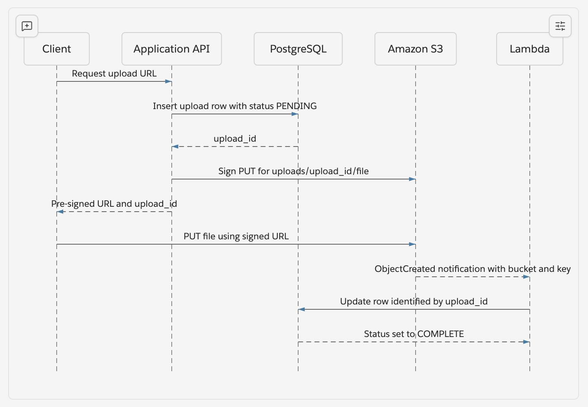

PreSigned URLs
To avoid uploading the same file twice (Once from the client to the App Server and the second time from the App Server to Blob Storage) we can use presigned URLs to allow our clients to directly upload or download their files. 

You can use presigned URLs to grant time-limited access to objects in Amazon S3 without updating your bucket policy. A presigned URL can be entered in a browser or used by a program to download an object. The credentials used by the presigned URL are those of the AWS Identity and Access Management (IAM) principal who generated the URL.

You can also use presigned URLs to allow someone to upload a specific object to your Amazon S3 bucket. This allows an upload without requiring another party to have AWS security credentials or permissions. If an object with the same key already exists in the bucket as specified in the presigned URL, Amazon S3 replaces the existing object with the uploaded object.

S3 Events
Amazon S3 automatically generates event notifications whenever an upload successfully completes. You can capture these completion events using either S3 Event Notifications or Amazon EventBridge. 

S3 fires specific events under the s3:ObjectCreated:* family depending on how the file was uploaded. For files being deleted, events come under s3:ObjectRemoved:*

s3 can deliver upload completion events to 4 main targets

1. Amazon EventBridge
2. AWS Lambda
3. Amazon SQS
4. Amazon SNS

You can use either FileSystemWatcher (Windows) or FSEvents (macOS) to monitor file system events. 

How do we update the FileMetaData after upload to S3 is complete?
The key is to create the PostgreSQL metadata row before giving the client the pre-signed URL, then encode a stable identifier into the S3 Object Key. S3 would then include the key as part of its event notification which our Lambda can parse and use to locate the correct database row. 



```
File Metadata table will contain the file ID {Twitter Snowflake or UUIDv7 based ID}
Object Key = uploads/<ID>/<file-name>
Generate a pre-signed URL that permits only PUT operation for that exact key
Return this to the client
```